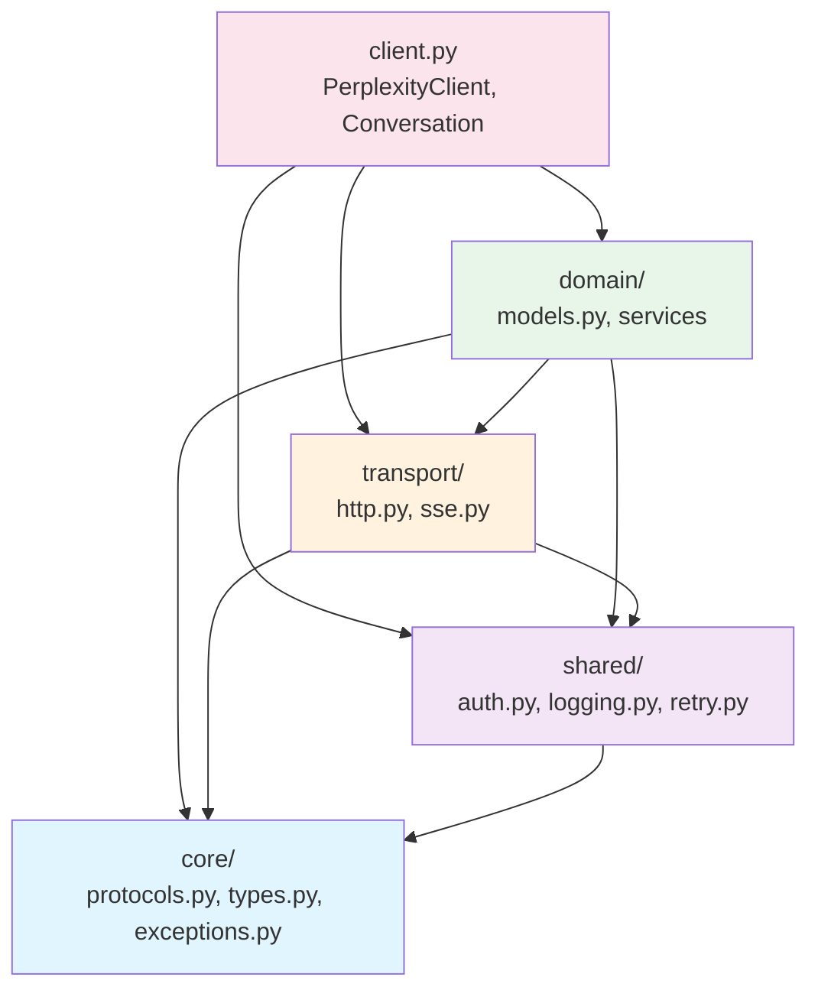
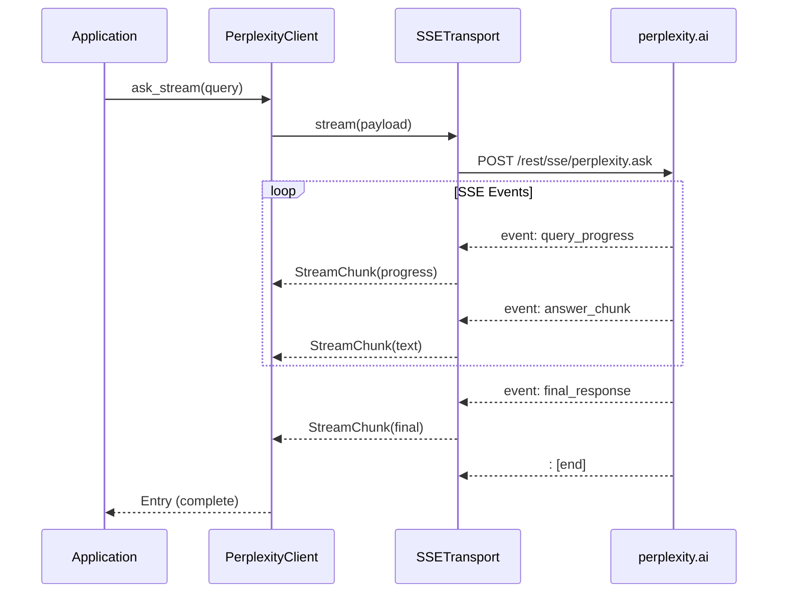
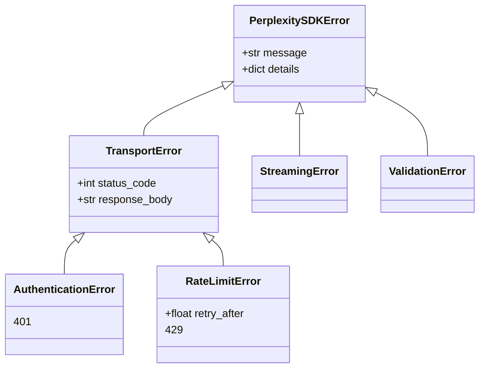
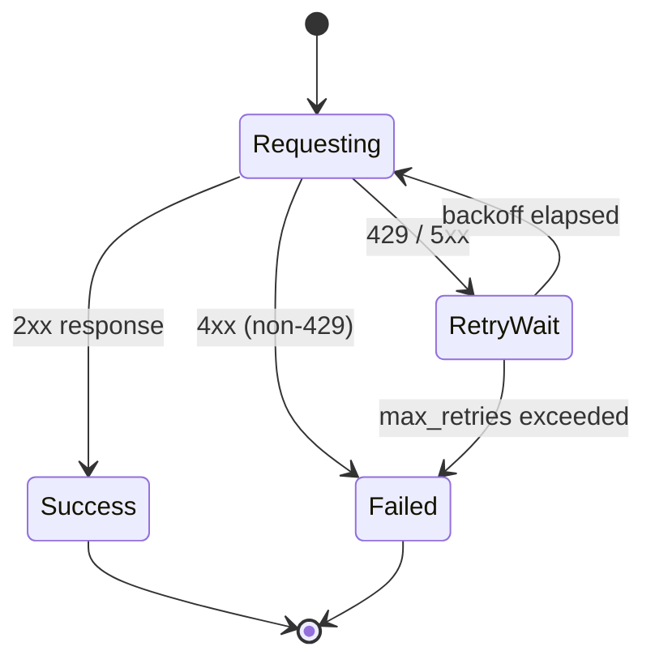

# Architecture Diagramming & Visualization

Create, maintain, and reason about pplx-sdk system architecture using Mermaid diagrams.

## When to use

Use this skill when:
- Visualizing system architecture or component relationships
- Designing a new feature and need to map dependencies
- Documenting data flow through the SDK layers
- Creating sequence diagrams for API call flows
- Analyzing import graphs to detect circular dependencies
- Onboarding — generating a visual overview of the codebase
- Planning refactors that touch multiple layers

## Instructions

### Step 1: Identify Diagram Type

| Need | Diagram Type | Mermaid Syntax |
|------|-------------|----------------|
| Layer overview | Layered block diagram | `block-beta` or `graph TD` |
| Data flow | Flowchart | `graph LR` |
| API call sequence | Sequence diagram | `sequenceDiagram` |
| Class relationships | Class diagram | `classDiagram` |
| State transitions | State diagram | `stateDiagram-v2` |
| Component dependencies | Dependency graph | `graph TD` |
| Deployment / infra | C4 or flowchart | `graph TD` with subgraphs |

### Step 2: Map the Architecture

The pplx-sdk layered architecture:

### Step 3: Generate Specific Diagrams

#### SSE Streaming Sequence

#### Exception Hierarchy

#### Retry State Machine

### Step 4: Embed in Documentation

Place diagrams in:
- `README.md` — high-level architecture overview
- `docs/architecture.md` — detailed component diagrams
- Inline in module docstrings — for complex flow explanations
- PR descriptions — for explaining changes visually

### Diagram Conventions

- Use consistent colors per layer (Core=blue, Shared=purple, Transport=orange, Domain=green, Client=pink)
- Label edges with function/method names when showing call flow
- Use subgraphs to group related components
- Include error paths in sequence diagrams (alt/opt blocks)
- Prefer top-down (`TD`) for hierarchy, left-right (`LR`) for flow

### Step 5: Validate Architecture

After diagramming, verify:
1. No upward dependencies (lower layers must not import higher layers)
2. No circular imports between modules
3. All public APIs are accessible through `client.py`
4. Exception hierarchy is consistent with `core/exceptions.py`
5. Transport protocol conformance (`core/protocols.py`)
