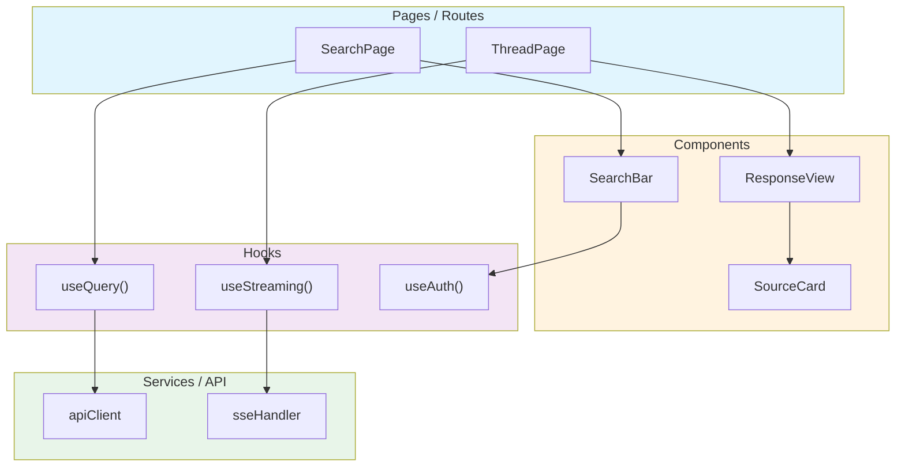

# Code Analysis — AST, Dependency Graphs & Knowledge Graphs

Parse, analyze, and visualize code structure through AST analysis, dependency graphing, and knowledge extraction. Supports **Python** (via `ast` module) and **JavaScript/TypeScript** (via `grep`-based import parsing and optional `@babel/parser` / `ts-morph`).

## When to use

Use this skill when:
- Building or updating a dependency graph of the codebase
- Analyzing imports to detect circular dependencies or layer violations
- Parsing Python AST to extract class hierarchies, function signatures, or call graphs
- Parsing JavaScript/TypeScript source to extract React component trees, ESM imports, and hook usage
- Generating a knowledge graph of code entities and their relationships
- Measuring code complexity (cyclomatic, cognitive, LOC) per module
- Identifying dead code, unused imports, or orphan modules
- Mapping how data flows through the SDK layers or SPA component hierarchy
- Understanding coupling between modules before a refactor
- Analyzing a SPA's source code structure (component graph, barrel exports, route tree)

## Instructions

### Step 1: AST Parsing

Parse Python source files to extract structured representations of code entities.

```python
import ast
from pathlib import Path

def parse_module(filepath: str) -> dict:
    """Extract entities from a Python module via AST."""
    source = Path(filepath).read_text()
    tree = ast.parse(source, filename=filepath)

    entities = {
        "module": filepath,
        "classes": [],
        "functions": [],
        "imports": [],
        "constants": [],
    }

    for node in ast.walk(tree):
        if isinstance(node, ast.ClassDef):
            entities["classes"].append({
                "name": node.name,
                "bases": [ast.dump(b) for b in node.bases],
                "methods": [n.name for n in node.body if isinstance(n, (ast.FunctionDef, ast.AsyncFunctionDef))],
                "decorators": [ast.dump(d) for d in node.decorator_list],
                "lineno": node.lineno,
            })
        elif isinstance(node, (ast.FunctionDef, ast.AsyncFunctionDef)):
            if not any(isinstance(parent, ast.ClassDef) for parent in ast.walk(tree)):
                entities["functions"].append({
                    "name": node.name,
                    "args": [arg.arg for arg in node.args.args],
                    "returns": ast.dump(node.returns) if node.returns else None,
                    "is_async": isinstance(node, ast.AsyncFunctionDef),
                    "lineno": node.lineno,
                })
        elif isinstance(node, ast.Import):
            for alias in node.names:
                entities["imports"].append({"module": alias.name, "alias": alias.asname})
        elif isinstance(node, ast.ImportFrom):
            entities["imports"].append({
                "module": node.module,
                "names": [alias.name for alias in node.names],
                "level": node.level,
            })

    return entities
```

### Step 2: Dependency Graph Construction

Build a directed graph of module-to-module dependencies.

```bash
# Quick import graph using grep
grep -rn "from pplx_sdk" pplx_sdk/ --include="*.py" | \
    awk -F: '{print $1 " -> " $2}' | \
    sed 's|pplx_sdk/||g' | sort -u

# Or using Python AST for precision
python3 -c "
import ast, os, json
graph = {}
for root, dirs, files in os.walk('pplx_sdk'):
    for f in files:
        if f.endswith('.py'):
            path = os.path.join(root, f)
            module = path.replace('/', '.').replace('.py', '')
            tree = ast.parse(open(path).read())
            deps = set()
            for node in ast.walk(tree):
                if isinstance(node, ast.ImportFrom) and node.module:
                    if node.module.startswith('pplx_sdk'):
                        deps.add(node.module)
                elif isinstance(node, ast.Import):
                    for alias in node.names:
                        if alias.name.startswith('pplx_sdk'):
                            deps.add(alias.name)
            if deps:
                graph[module] = sorted(deps)
print(json.dumps(graph, indent=2))
"
```

#### Expected Layer Dependencies


### Step 3: Knowledge Graph Extraction

Build a knowledge graph connecting code entities with typed relationships.

#### Entity Types

| Entity | Source | Example |
|--------|--------|---------|
| `Module` | File path | `pplx_sdk.transport.sse` |
| `Class` | AST ClassDef | `SSETransport`, `PerplexityClient` |
| `Function` | AST FunctionDef | `stream_ask`, `retry_with_backoff` |
| `Protocol` | typing.Protocol | `Transport`, `StreamParser` |
| `Exception` | Exception subclass | `TransportError`, `RateLimitError` |
| `Type` | TypeAlias | `Headers`, `JSONData`, `Mode` |
| `Constant` | Module-level assign | `SSE_ENDPOINT`, `DEFAULT_TIMEOUT` |

#### Relationship Types

| Relationship | Meaning | Example |
|-------------|---------|---------|
| `IMPORTS` | Module imports another | `transport.sse IMPORTS core.protocols` |
| `DEFINES` | Module defines entity | `core.exceptions DEFINES TransportError` |
| `INHERITS` | Class extends another | `AuthenticationError INHERITS TransportError` |
| `IMPLEMENTS` | Class implements protocol | `SSETransport IMPLEMENTS Transport` |
| `CALLS` | Function calls another | `stream_ask CALLS retry_with_backoff` |
| `RETURNS` | Function returns type | `stream_ask RETURNS Iterator[StreamChunk]` |
| `RAISES` | Function raises exception | `request RAISES AuthenticationError` |
| `USES_TYPE` | Function uses type hint | `request USES_TYPE Headers` |
| `BELONGS_TO` | Entity belongs to layer | `SSETransport BELONGS_TO transport` |

#### Knowledge Graph as Mermaid


### Step 4: Code Complexity Analysis

```bash
# Lines of code per module
find pplx_sdk -name "*.py" -exec wc -l {} + | sort -n

# Cyclomatic complexity (if radon is available)
pip install radon 2>/dev/null && radon cc pplx_sdk/ -s -a

# Function count per module
grep -c "def " pplx_sdk/**/*.py 2>/dev/null || \
    find pplx_sdk -name "*.py" -exec grep -c "def " {} +

# Class count per module
find pplx_sdk -name "*.py" -exec grep -c "class " {} +
```

### Step 5: Pattern Detection

Detect common patterns and anti-patterns in the codebase:

| Check | Command | What to Look For |
|-------|---------|-----------------|
| Circular imports | AST import graph cycle detection | Cycles in the dependency graph |
| Layer violations | Import direction analysis | Lower layers importing higher layers |
| Unused imports | `ruff check --select F401` | Imports that are never used |
| Dead code | `vulture pplx_sdk/` (if available) | Functions/classes never called |
| Missing types | `mypy pplx_sdk/ --strict` | Untyped functions or `Any` usage |
| Large functions | AST line count per function | Functions > 50 lines |
| Deep nesting | AST indent depth analysis | Nesting > 4 levels |
| Protocol conformance | Compare class methods vs Protocol | Missing protocol method implementations |

### Step 6: JavaScript/TypeScript Code Graph (SPA)

When analyzing a SPA codebase (React, Next.js, Vite), build a code graph from JavaScript/TypeScript source files.

#### Import Graph Extraction

```bash
# ESM imports (import ... from '...')
grep -rn "import .* from " src/ --include="*.ts" --include="*.tsx" --include="*.js" --include="*.jsx" | \
    sed "s/:/ → /" | sort -u

# Re-exports / barrel files
grep -rn "export .* from " src/ --include="*.ts" --include="*.tsx" | sort -u

# Dynamic imports (lazy loading / code splitting)
grep -rn "import(" src/ --include="*.ts" --include="*.tsx" | sort -u

# CommonJS requires (legacy)
grep -rn "require(" src/ --include="*.js" | sort -u
```

#### React Component Tree

```bash
# Find all React components (function components)
grep -rn "export \(default \)\?function \|export const .* = (" src/ --include="*.tsx" --include="*.jsx"

# Find component usage (JSX self-closing or opening tags)
grep -rn "<[A-Z][a-zA-Z]*[\ />\n]" src/ --include="*.tsx" --include="*.jsx" | \
    grep -oP '<[A-Z][a-zA-Z]*' | sort | uniq -c | sort -rn

# Find hooks usage
grep -rn "use[A-Z][a-zA-Z]*(" src/ --include="*.ts" --include="*.tsx" | \
    grep -oP 'use[A-Z][a-zA-Z]*' | sort | uniq -c | sort -rn

# Find context providers
grep -rn "createContext\|\.Provider" src/ --include="*.tsx" --include="*.ts"
```

#### Route Tree (Next.js / React Router)

```bash
# Next.js App Router pages
find app/ -name "page.tsx" -o -name "page.jsx" -o -name "layout.tsx" 2>/dev/null

# Next.js Pages Router
find pages/ -name "*.tsx" -o -name "*.jsx" 2>/dev/null

# React Router route definitions
grep -rn "Route\|createBrowserRouter\|path:" src/ --include="*.tsx" --include="*.ts"
```

#### SPA Dependency Graph as Mermaid



#### SPA Entity Types

| Entity | Source | Example |
|--------|--------|---------|
| `Component` | Function returning JSX | `SearchBar`, `ResponseView` |
| `Hook` | `use*` function | `useQuery`, `useAuth` |
| `Context` | `createContext()` | `AuthContext`, `ThemeContext` |
| `Route` | Page/layout file | `/search`, `/thread/[id]` |
| `Service` | API client module | `apiClient`, `sseHandler` |
| `Store` | State management | Zustand store, Redux slice |
| `Type` | TypeScript interface/type | `SearchResult`, `ThreadData` |

#### SPA Relationship Types

| Relationship | Meaning | Example |
|-------------|---------|---------|
| `RENDERS` | Component renders another | `SearchPage RENDERS SearchBar` |
| `USES_HOOK` | Component uses a hook | `SearchPage USES_HOOK useQuery` |
| `PROVIDES` | Component provides context | `AuthProvider PROVIDES AuthContext` |
| `CONSUMES` | Component consumes context | `SearchBar CONSUMES AuthContext` |
| `CALLS_API` | Hook/service calls API endpoint | `useQuery CALLS_API /rest/search` |
| `IMPORTS` | Module imports another | `SearchPage IMPORTS SearchBar` |
| `LAZY_LOADS` | Dynamic import for code splitting | `App LAZY_LOADS SettingsPage` |
| `EXTENDS_TYPE` | Type extends another | `ThreadResponse EXTENDS_TYPE BaseResponse` |

### Step 7: Output Insights Report

Generate a structured report combining all analyses:

```markdown
## Code Analysis Report: pplx-sdk

### Module Summary
| Module | Classes | Functions | Lines | Complexity |
|--------|---------|-----------|-------|------------|
| core/protocols.py | 2 | 0 | 45 | A |
| transport/sse.py | 1 | 5 | 180 | B |
| ... | ... | ... | ... | ... |

### SPA Component Summary (when analyzing JS/TS)
| Component | Props | Hooks Used | Children | Lines |
|-----------|-------|------------|----------|-------|
| SearchPage | 2 | useQuery, useAuth | SearchBar, ResultList | 120 |
| ... | ... | ... | ... | ... |

### Dependency Graph
[Mermaid diagram]

### Knowledge Graph
- N entities, M relationships
- [Mermaid diagram]

### Layer Compliance
- ✅ No circular dependencies
- ✅ No upward layer violations
- ⚠️ 2 unused imports detected

### Complexity Hotspots
| Function | Module | CC | Lines | Recommendation |
|----------|--------|----|-------|----------------|
| `_parse_event` | transport/sse.py | 8 | 45 | Consider splitting |

### Dead Code
| Entity | Module | Last Referenced |
|--------|--------|----------------|
| ... | ... | ... |
```

## Documentation Discovery

When analyzing dependencies or researching libraries, use these discovery methods to find LLM-optimized documentation:

### llms.txt / llms-full.txt

The `llms.txt` standard provides LLM-optimized documentation at known URLs:

```bash
# Check if a dependency publishes llms.txt
curl -sf https://docs.pydantic.dev/llms.txt | head -20
curl -sf https://www.python-httpx.org/llms.txt | head -20

# Check for the full version (entire docs in one file)
curl -sf https://docs.pydantic.dev/llms-full.txt | head -20

# Use the llms-txt MCP server for indexed search
# Tools: list_llm_txt, get_llm_txt, search_llm_txt
```

### .well-known/agentskills.io

Discover agent skills published by libraries and frameworks:

```bash
# Check if a site publishes agent skills
curl -sf https://example.com/.well-known/agentskills.io/skills/ | head -20

# Look for specific SKILL.md files
curl -sf https://example.com/.well-known/agentskills.io/skills/default/SKILL.md
```

### MCP Documentation Servers

| MCP Server | Purpose | Key Tools |
|-----------|---------|-----------|
| `context7` | Library docs lookup | Context-aware search by library name |
| `deepwiki` | GitHub repo documentation | `read_wiki_structure`, `read_wiki_contents`, `ask_question` |
| `llms-txt` | llms.txt file search | `list_llm_txt`, `get_llm_txt`, `search_llm_txt` |
| `fetch` | Any URL as markdown | General-purpose URL fetching |

### Discovery Workflow

```
1. Check llms.txt at dependency's docs URL
2. Check .well-known/agentskills.io for skills
3. Query deepwiki for the dependency's GitHub repo
4. Query context7 for library-specific context
5. Fall back to fetch for raw documentation URLs
```

## Integration with Other Skills

| When code-analysis finds... | Delegate to... | Action |
|---------------------------|----------------|--------|
| Layer violation | `architect` | Produce corrected dependency diagram |
| Circular import | `code-reviewer` | Review and suggest refactor |
| Missing protocol method | `scaffolder` | Scaffold missing implementation |
| Dead code | `code-reviewer` | Confirm and remove |
| High complexity | `code-reviewer` | Review for refactor opportunity |
| New entity relationships | `architect` | Update architecture diagrams |
| SPA component tree | `spa-expert` | Cross-reference with runtime fiber tree |
| SPA API endpoints in source | `reverse-engineer` | Validate against live traffic captures |
| SPA hook dependencies | `architect` | Visualize hook → service → API chain |
| SPA barrel file cycles | `code-reviewer` | Review circular re-exports |
