# Agent Handoff Architecture Diagrams

## 1. Dual-Path Architecture


## 2. Agent Handoff Workflow (Issue #6 Example)

```mermaid
sequenceDiagram
    participant O as Orchestrator
    participant CR as Code Reviewer
    participant TR as Test Runner
    participant S as Scaffolder
    participant I as Implementation
    
    O->>CR: Phase 1: Explore utils/ structure
    CR->>CR: Find files, imports, dependencies
    CR-->>O: Artifact: {files: [...], imports: [...]}
    
    O->>TR: Phase 2: Run baseline tests
    TR->>TR: pytest tests/ -v
    TR-->>O: Artifact: {tests_passed: true}
    
    O->>S: Phase 3: Create shared/ structure
    S->>S: Create shared/, retry.py, __init__.py
    S-->>O: Artifact: {created: [...]}
    
    O->>I: Phase 4: Implement retry logic
    I->>I: Extract from StreamManager, update imports
    I-->>O: Artifact: {implemented: [...]}
    
    O->>TR: Phase 5: Test implementation
    TR->>TR: Create test_retry.py, run all tests
    TR-->>O: Artifact: {tests_passed: true}
    
    O->>CR: Phase 6: Final review
    CR->>CR: Check layers, types, docs
    CR-->>O: Artifact: {approved: true}
    
    O->>O: ✅ Workflow Complete
```



## 3. Skill & Subagent Mapping


## 4. Standard Workflows


## 5. Layer Architecture


## 6. MCP Server Integration

```mermaid
graph TB
    subgraph "Agents"
        A1[GitHub Copilot]
        A2[External Runners]
    end
    
    subgraph "MCP Protocol Layer"
        M[MCP JSON-RPC]
    end
    
    subgraph "HTTP MCP Servers"
        H1[github-rw<br/>api.githubcopilot.com]
        H2[perplexity_ai<br/>api.perplexity.ai]
    end
    
    subgraph "NPX MCP Servers"
        N1[deep-wiki<br/>mcp-deepwiki]
        N2[fetch<br/>@anthropic-ai/mcp-fetch]
        N3[context7<br/>@upstash/context7-mcp]
        N4[llms-txt<br/>@mcp-get-community/server-llm-txt]
    end
    
    A1 --> M
    A2 --> M
    
    M --> H1
    M --> H2
    M --> N1
    M --> N2
    M --> N3
    M --> N4
    
    H1 --> GH[GitHub API]
    H2 --> PP[Perplexity API]
    N1 --> WK[Wikipedia]
    N2 --> WEB[Web Content]
    N3 --> DOC[Documentation]
    N4 --> LLM[LLM Docs]
    
    style A1 fill:#4CAF50
    style A2 fill:#2196F3
    style M fill:#FF9800
    style H1 fill:#9C27B0
    style H2 fill:#9C27B0
    style N1 fill:#00BCD4
    style N2 fill:#00BCD4
    style N3 fill:#00BCD4
    style N4 fill:#00BCD4
```

## Legend

- 🟢 Green: GitHub Copilot / Entry points
- 🔵 Blue: External runners / Subagents
- 🟠 Orange: MCP servers / Transport layer
- 🟣 Purple: Shared utilities / HTTP MCP
- 🔴 Red: Core protocols / Foundation
- 🔷 Cyan: NPX MCP servers

## Usage in Documentation

These diagrams can be:
1. Embedded in README.md
2. Linked from agent.json
3. Used in onboarding docs
4. Referenced in PR descriptions
5. Displayed in architecture reviews
